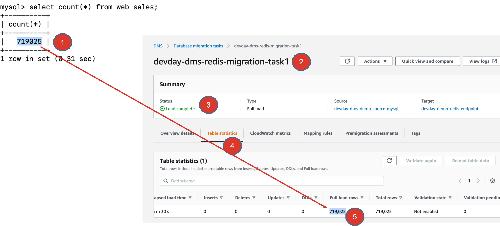
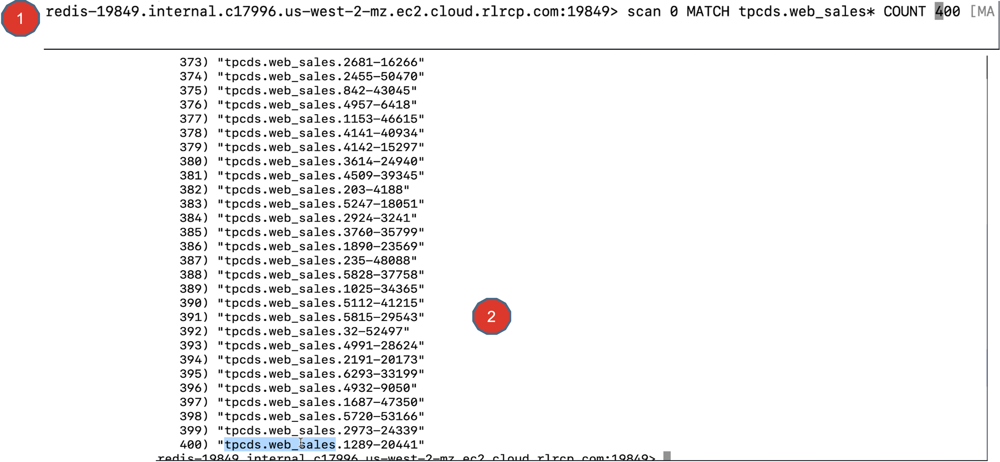
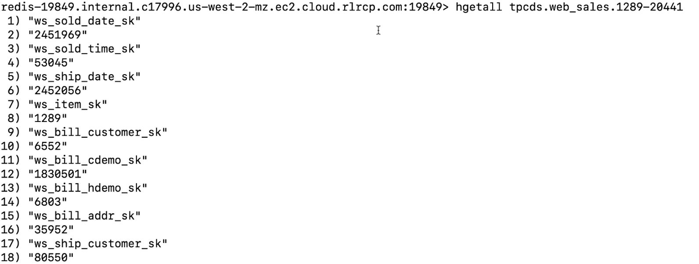

# Lab 8 - Verifying Migration results

## Objectives
In this exercise, you will
* After successfully completing the migration, you will verify the results, to ensure that the data from the source MySQL database has been migrated to Redis Enterprise Cloud on AWS.

## Hands-on lab exercise steps

1. The easiest way to ensure that the data is fully migrated is to check the record count in the source MySQL database and comparing that with the “Full load rows” information found in  migration task table statistics, as shown.



2. Another way is to directly verify the data in the target system – Redis Enterprise Cloud in AWS. To do this, simply use an EC2 machine, for example, you can use the same EC2 machine where you are running your MySQL server.

This time, run a Redis client based off the Redis container. To do so, download redis docker image and run a redis container to act as a “redis-cli” client.
```
docker pull redis
docker images
docker run -it  --rm redis redis-cli -h <redis-private-endpoint> –p <redis-endpoint-port> -a <redis_default_user_password>
```
Replace `<redis-private-endpoint>`, `<redis-endpoint-port>`, `<redis_default_user_password>` with actual Redis endpooint details, in the above command.

Here is a screenshot of connecting to Redis Enterprise Cloud (private endpoint) using redis-cli.


3. Using redis-cli, you can run the following commands to scan for data presence.

Here you are running a redis SCAN command to see the data. By default, you will see 10 records stargin from the cursor 0, as mentioned in the command.


4. You can also display the records starting from cursor position 0, matching a pattern like “tpcds.web_sales*” counting up to 400 records. As shown below.



5. You can also display the specific details of a record too. In this case, you can use `hgetall` redis command and pass the key “tpcds.web_sales.1289-20441”.




## Summary
There you go. You have successfully verified that the data has been migrated to Redis Enterprise Cloud by multiple ways.
* By checking the record count match between source system and the migration task table statistics.
* By checking the data presence in the Redis Enterprise Cloud.

Congratulations. By now you did the most of the work, you deserve to celebrate. Go take a break.


